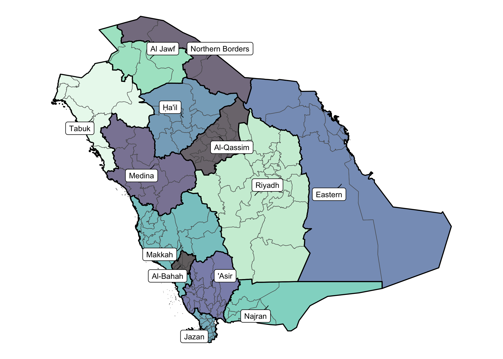

<!-- README.md is generated from README.Rmd. Please edit that file -->

# saudimap 🇸🇦

<!-- badges: start -->


<!-- badges: end -->

I couldn’t really find a good source of map data for Saudi Arabia’s
administrative boundaries, so I created my own from OpenStreetMap data
using the `{osmdata}` package. In the `data/` folder, you will find:

1.  Dataset containing the regions and governorates of Saudi Arabia as
    `sf` objects, along with population data where available. Load the
    dataset in R using

    ``` r
    library(sf)
    #> Linking to GEOS 3.13.0, GDAL 3.8.5, PROJ 9.5.1; sf_use_s2() is TRUE
    load("data/ksamaps.Rdata")
    ```

2.  GeoJSON files for the same, if you prefer these instead.

## Features

There are two `sf` objects:

1.  `reg_sf`: the 13 regions of Saudi Arabia
2.  `gov_sf`: the 149 governorates of Saudi Arabia

### Data

``` r
# What's in our data set?
tibble::glimpse(gov_sf)
#> Rows: 149
#> Columns: 7
#> $ governorate       <chr> "Dammam", "Khobar", "Abqaiq", "Al Ahsa", "Al Udayd",…
#> $ population        <chr> "903597", "578500", "53444", "1063112", NA, "52340",…
#> $ population.date   <chr> "2010", "2010", "2010", "2010", NA, "2010", "2022", …
#> $ source            <chr> "covid19 saudi MOH open data", "covid19 saudi MOH op…
#> $ source.population <chr> "stats.gov.sa", "stats.gov.sa", "stats.gov.sa", "sta…
#> $ region            <chr> "Eastern", "Eastern", "Eastern", "Eastern", "Eastern…
#> $ geometry          <MULTIPOLYGON [°]> MULTIPOLYGON (((50.07442 26..., MULTIPO…
```

### Plot

``` r
library(ggplot2)
ggplot() +
  geom_sf(data = gov_sf, aes(fill = region), alpha = 0.65) +
  geom_sf(data = reg_sf, fill = NA, linewidth = 0.5, col = "black") +
  ggrepel::geom_label_repel(
    data = reg_sf,
    aes(label = region, geometry = geometry),
    size = 2.7,
    stat = "sf_coordinates",
    max.overlaps = Inf,
    min.segment.length = 0,
    segment.size = 0.3,
    segment.curvature = 0.1,
    force = 5
  ) +
  scale_fill_viridis_d(option = "mako", guide = "none") +
  theme_void()
```

<!-- -->

## Creating the datasets

The code used to create the datasets is in `R/create_maps.R`. The main
steps were:

1.  Use `{osmdata}` to pull all admin boundaries for Saudi Arabia from
    OpenStreetMap, filtering for admin levels 4 (regions) and 5/6
    (governorates).

2.  Intersect the polygons with the overall boundary of Saudi Arabia to
    remove any spillover from neighboring countries.

3.  Clean up the data by removing non-polygon geometries and ensuring
    all geometries are valid.

4.  Wrangle the data into two separate datasets: one for regions and one
    for governorates, including relevant attributes like name and
    population.

5.  The governorate dataset needed to be matched with the correct
    region. This was the difficult bit, since the names are not exact.
    For e.g. “Khubar” and “Khobar” refer to the same place, and so to
    “Medina” and “Al-Madina” and “Al Medina”. This needed to be done
    manually, and for this I created the `data/governorates.csv` file.
    If there’s a standardised version of names and regions that would
    have been helpful, but I don’t know where to find that.

## Source

As mentioned, the data comes from OpenStreetMap, which is crowd-sourced
and open data. According to the
[Wiki](https://wiki.openstreetmap.org/wiki/Saudi_Arabia/Admin_Boundaries_of_Regions_and_Governorates_Import),
the KSA data was obtained from official government sources, namely the
Saudi MOH Open Data (seems related to Covid-19 times).
